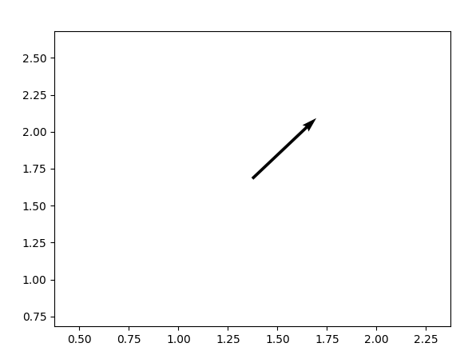
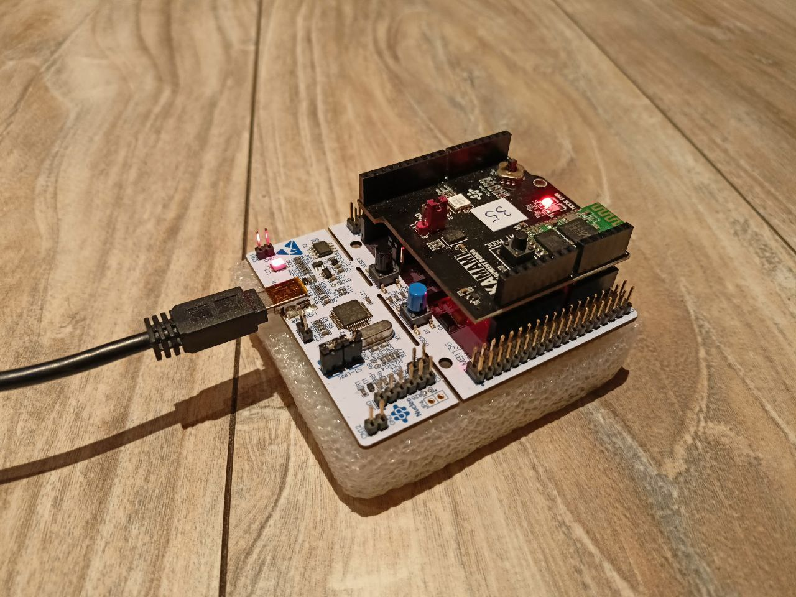

# Motion control for STM32 microcontroller using Bluetooth

Simple application created as a part of Microcontrollers Programming course at MIMUW. It allows for reading and sending motion data to the connected device via Bluetooth. The application is written in C and was developed using STM32F411RET6 with Nucleo-F411RE.

## Microcontroller application

The application works in sleep mode using interrupts to wake up the microcontroller. The interrupts are triggered by the accelerometer, buttons and the Bluetooth module. 

The accelerometer is used to detect tilting of the device. After receiving the interrupt, the microcontroller reads the accelerometer data and sends 3 infomation bytes to the connected device via Bluetooth using USART with DMA. The first byte is the start byte (0x01), the second byte is the change in the X axis and the third byte is the change in the Y axis. The change is calculated with moving average by subtracting the current value from some set state. The change is then sent as a signed byte. The communication with the accelerometer is done using I2C.
The information from the accelerometer is sent every 10ms.

### Buttons

Additionally to the basic functionality I have decided to add two buttons to the application:

* USER button - used to set the `stationary` state of the device. It allows to use the device on a tilted surface or to set a constant message without keeping the device titled.
* MODE button - while pressed, stops sending the data to the connected device. Useful when trying to move the device without sending any disruptive the data.

## Demo

To demonstrate the use of the application a minimalistic demo is provided. The is written in Python and uses matplotlib to display the received data and reads the incoming data as raw bytes from `/dev/rfcomm1`.

## Usage

To build the application, use the provided Makefile. However the correct libraries must be present in the `/opt/arm/stm32` directory.
For the typical `students` configuration, to build and install the application, run:
```
make
/opt/arm/stm32/ocd/qfn4
```

To run the demo, first connect the device to the computer using Bluetooth.
```
sudo rfcomm connect /dev/rfcomm1 <addr> 1  
```
Then run the demo:
```
[sudo] python3 demo.py
```

## Images





